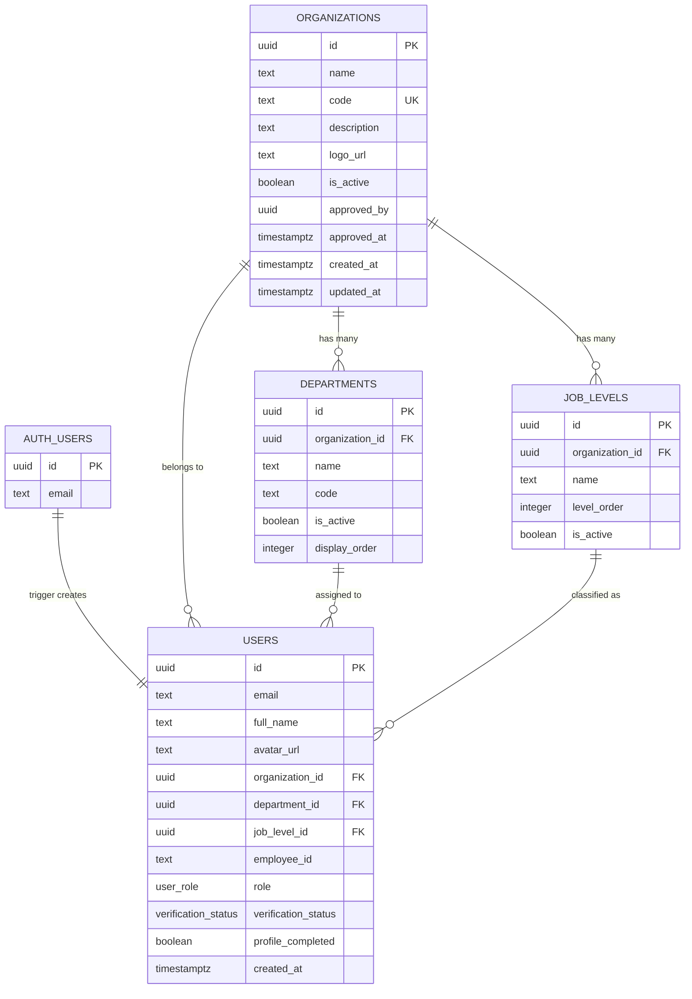
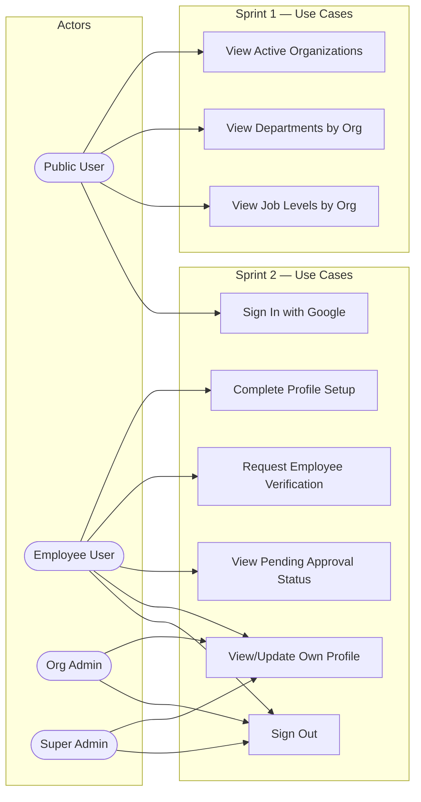
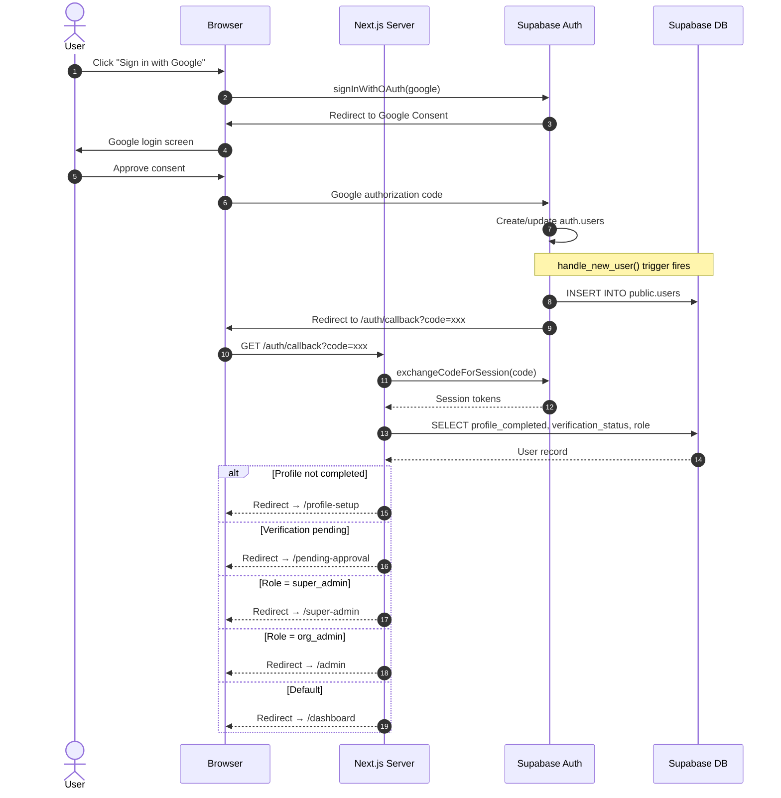
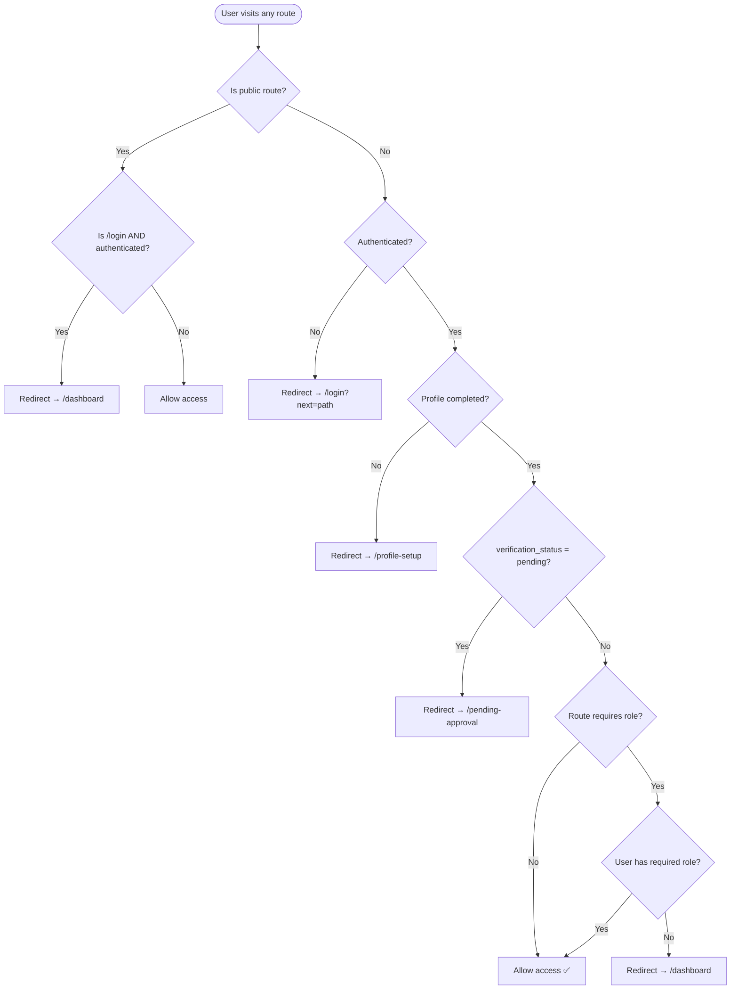
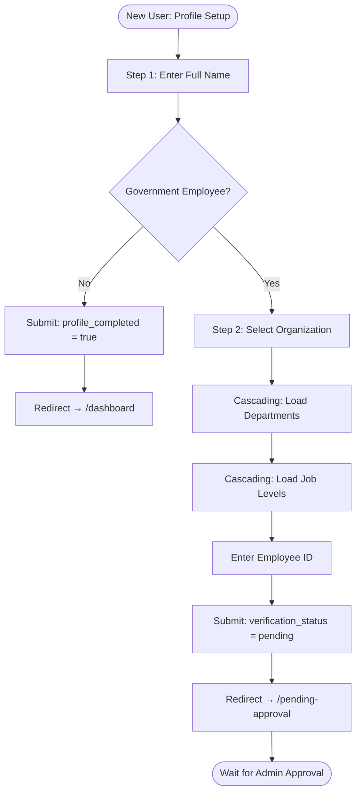
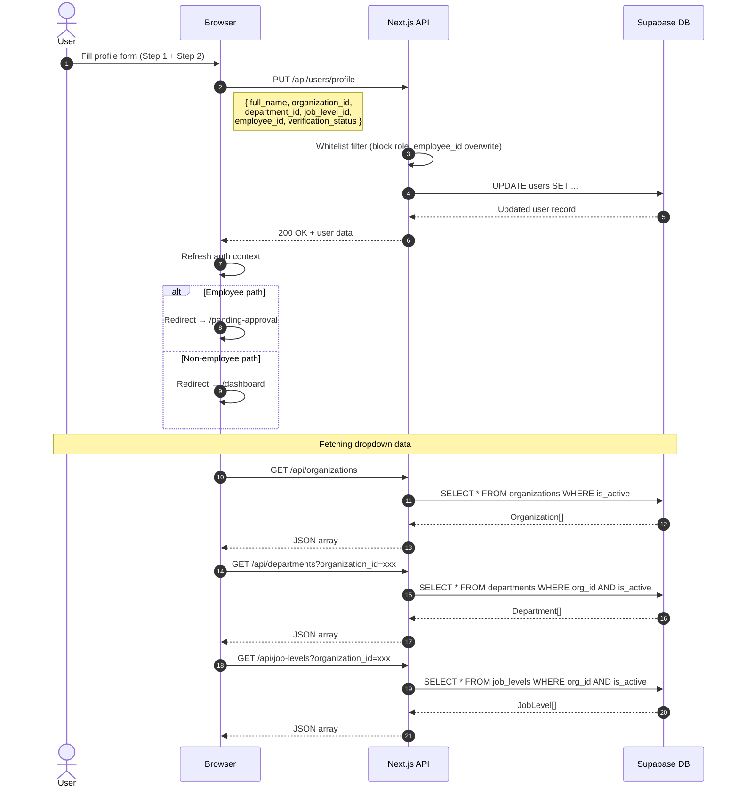
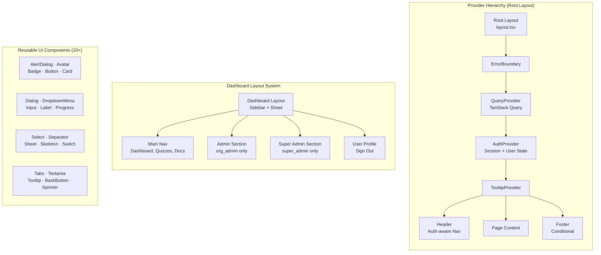
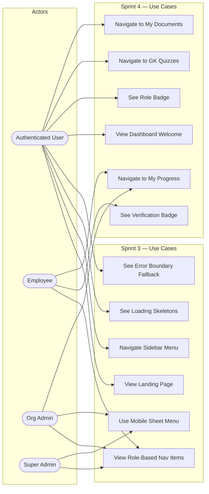
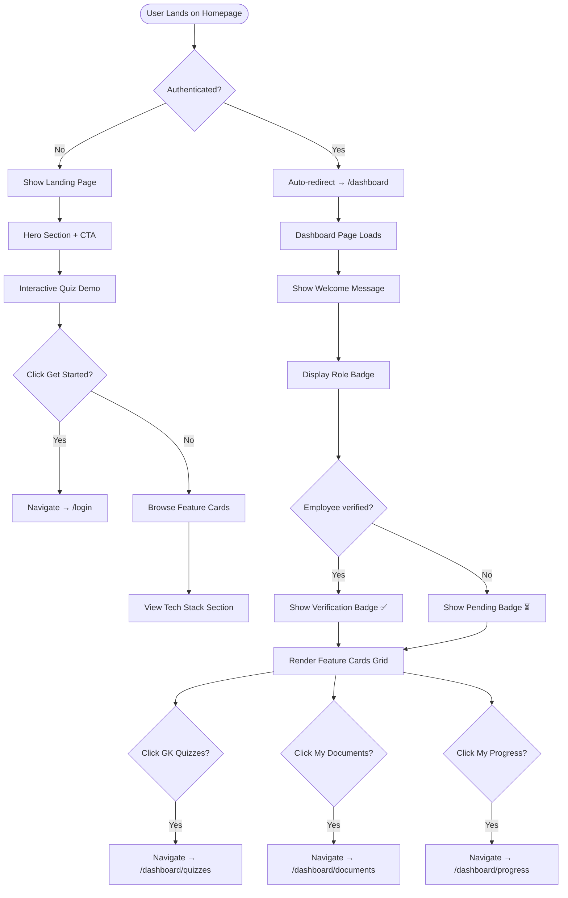
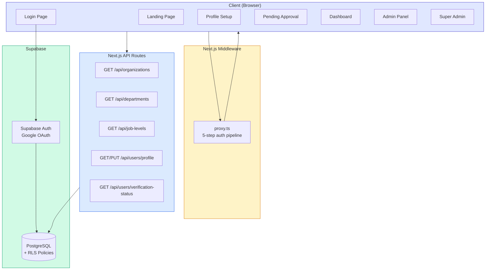

# LokAI — Sprint Reviews

**Project**: LokAI — AI-Powered Exam Preparation Platform for Nepal Government Employees  
**Tech Stack**: Next.js 16 (App Router) · React 19 · Supabase (PostgreSQL + Auth) · Tailwind CSS 4 · shadcn/ui · TanStack Query · Framer Motion · TypeScript

---

## Per-Sprint Review Folders

Each sprint has its own folder with a detailed review and individual diagram files:

| Sprint | Folder | Diagrams |
|--------|--------|----------|
| Sprint 1 — Foundation & Database | [sprint-1/](./sprint-1/) | ER Diagram, Use Case, Activity (Migration), Sequence (Trigger) |
| Sprint 2 — Auth & Onboarding | [sprint-2/](./sprint-2/) | Sequence (OAuth, Profile API), Activity (Middleware, Profile Setup), Use Case |
| Sprint 3 — UI Components & Layout | [sprint-3/](./sprint-3/) | Component Architecture, Use Case |
| Sprint 4 — Dashboard & Landing | [sprint-4/](./sprint-4/) | Activity (Navigation), Use Case, Architecture |

---

## Sprint 1 Review — Project Foundation & Database Design

### Sprint Goal
Set up the project skeleton, database schema with Row-Level Security, and development environment.

### Sprint Duration
Sprint 1 of 13 planned sprints

### Deliverables Completed (13/13 — 100%)

| # | Task | Status |
|---|------|--------|
| 1.1 | Initialize Next.js 16 project with TypeScript, Tailwind CSS 4, ESLint | ✅ |
| 1.2 | Install core dependencies (Supabase SSR, TanStack Query, Framer Motion, Radix UI, Zod, React Hook Form, Recharts, Sonner, Lucide icons) | ✅ |
| 1.3 | Configure Supabase browser client (`client.ts`) and server client (`server.ts`) | ✅ |
| 1.4 | Create combined migration script (`migrations/000_run_all.sql`) | ✅ |
| 1.5 | Design `organizations` table with RLS policies | ✅ |
| 1.6 | Design `departments` table with cascading FK, composite unique constraint | ✅ |
| 1.7 | Design `job_levels` table with org FK, level ordering | ✅ |
| 1.8 | Design `users` table with role/verification enums, full RLS policy set | ✅ |
| 1.9 | Create shared `update_updated_at()` trigger function | ✅ |
| 1.10 | Create `handle_new_user()` trigger for auto-populating users on auth signup | ✅ |
| 1.11 | Seed 3 organizations (MOFA, NEA, NRB) with departments and job levels | ✅ |
| 1.12 | Define TypeScript types matching DB schema (`types/database.ts`) | ✅ |
| 1.13 | Create utility function `cn()` for Tailwind class merging | ✅ |

### Key Files Produced

| File | Purpose |
|------|---------|
| `migrations/000_run_all.sql` | Full database schema (7 sections), RLS policies, triggers, seed data |
| `lib/supabase/client.ts` | Browser-side Supabase client (cookie-based auth) |
| `lib/supabase/server.ts` | Server-side Supabase client (async cookie access) |
| `types/database.ts` | TypeScript interfaces: Organization, Department, JobLevel, User, UserWithDetails |
| `lib/utils.ts` | Tailwind `cn()` merge utility |

### ER Diagram — Database Schema



### Database Design Decisions

| Decision | Rationale |
|----------|-----------|
| UUID primary keys | Supabase standard, prevents enumeration attacks |
| Composite unique `(org_id, code)` on departments | Allows same dept code across different orgs |
| `level_order` on job_levels | Enables ascending seniority sorting |
| Role enum (`public/employee/org_admin/super_admin`) | Fixed role hierarchy, no dynamic RBAC overhead |
| Verification status enum (`none/pending/verified/rejected`) | Clear state machine for employee onboarding |
| RLS on all 4 tables | Defense-in-depth — database enforces access even if API has bugs |
| `handle_new_user()` trigger | Auto-creates public.users row from auth.users signup — zero manual sync |
| Idempotent migration (`IF NOT EXISTS`) | Safe to re-run without errors |

### Seed Data

| Organization | Code | Departments | Job Levels |
|-------------|------|-------------|------------|
| Ministry of Federal Affairs and General Administration | MOFA | 5 | 4 |
| Nepal Electricity Authority | NEA | 5 | 4 |
| Nepal Rastra Bank | NRB | 5 | 4 |

### Sprint 1 Retrospective

| Category | Notes |
|----------|-------|
| **What went well** | Clean separation of DB concerns with 7-section migration. TypeScript types perfectly mirror DB schema. RLS policies cover all role combinations. |
| **What could improve** | No automated migration runner yet — SQL must be pasted into Supabase SQL Editor manually. |
| **Risks mitigated** | Type safety between frontend and DB ensured via `database.ts`. Auth trigger eliminates manual user creation bugs. |
| **Carry-forward** | Supabase client configs are reused in every subsequent sprint. Seed data enables immediate testing. |

---

## Sprint 2 Review — Authentication & User Onboarding

### Sprint Goal
Implement the complete auth flow with Google OAuth, route protection middleware, profile setup wizard, employee verification pipeline, and all public/protected API endpoints.

### Sprint Duration
Sprint 2 of 13 planned sprints

### Deliverables Completed (14/14 — 100%)

| # | Task | Status |
|---|------|--------|
| 2.1 | AuthProvider context with session management, auto-refresh, profile sync | ✅ |
| 2.2 | QueryProvider with TanStack Query defaults (60s stale, 1 retry, devtools) | ✅ |
| 2.3 | ErrorBoundary class component with fallback UI | ✅ |
| 2.4 | Login page with tabbed UI — Personal (Google) + Organization (email/password) | ✅ |
| 2.5 | OAuth callback handler with role-based routing | ✅ |
| 2.6 | Route protection middleware (5-step auth pipeline) | ✅ |
| 2.7 | 2-step profile setup wizard with Zod + React Hook Form | ✅ |
| 2.8 | Organization/Department/Job-Level selector components with TanStack Query | ✅ |
| 2.9 | Pending approval page with status check, rejection display, reapply flow | ✅ |
| 2.10 | Verification status API endpoint | ✅ |
| 2.11 | User profile GET/PUT API with field whitelist security | ✅ |
| 2.12 | Organizations API endpoint | ✅ |
| 2.13 | Departments API endpoint with org_id filter | ✅ |
| 2.14 | Job Levels API endpoint with org_id filter | ✅ |

### Key Files Produced

| File | Purpose |
|------|---------|
| `proxy.ts` | Route protection middleware (5-step pipeline) |
| `app/auth/callback/route.ts` | OAuth callback with role-based routing |
| `app/login/page.tsx` | Tabbed login (Google + Org Admin) |
| `app/profile-setup/page.tsx` | 2-step onboarding wizard |
| `app/pending-approval/page.tsx` | Verification pending status page |
| `components/providers/auth-provider.tsx` | AuthContext: session, user, signIn/Out |
| `components/providers/query-provider.tsx` | TanStack Query configuration |
| `components/selectors/` | Organization, Department, Job Level cascading selectors |
| `api/organizations/route.ts` | GET all active organizations |
| `api/departments/route.ts` | GET departments by org_id |
| `api/job-levels/route.ts` | GET job levels by org_id |
| `api/users/profile/route.ts` | GET/PUT user profile (whitelist-protected) |
| `api/users/verification-status/route.ts` | GET verification status |

### Use Case Diagram — Sprint 1 & 2



### Sequence Diagram — Google OAuth Authentication Flow



### Activity Diagram — Route Protection Middleware



### Activity Diagram — Profile Setup Flow



### Sequence Diagram — Profile Setup API Calls



### API Endpoints Delivered

| Method | Endpoint | Auth | Description |
|--------|----------|------|-------------|
| GET | `/api/organizations` | Public | List active organizations |
| GET | `/api/departments?organization_id=` | Public | Departments filtered by org |
| GET | `/api/job-levels?organization_id=` | Public | Job levels filtered by org |
| GET | `/api/users/profile` | Auth | Fetch user profile with joins |
| PUT | `/api/users/profile` | Auth | Update profile (whitelist-protected) |
| GET | `/api/users/verification-status` | Auth | Check verification status |

### Security Measures Implemented

| Measure | Implementation |
|---------|---------------|
| Field whitelist on PUT | Only `full_name`, `organization_id`, `department_id`, `job_level_id`, `profile_completed` are accepted — `role`, `employee_id`, `verification_status` are blocked |
| Route protection | 5-step middleware pipeline enforces auth, profile, verification, and role checks |
| Session refresh | Middleware refreshes Supabase tokens on every request to prevent expired sessions |
| OAuth state validation | `exchangeCodeForSession()` validates the OAuth authorization code server-side |
| RLS enforcement | Even if API bypassed, database policies enforce row-level access |

### Sprint 2 Retrospective

| Category | Notes |
|----------|-------|
| **What went well** | Complete auth pipeline from OAuth → routing → profile → verification in one sprint. Middleware handles 5 distinct security gates cleanly. Reusable cascading selectors built for future sprints. |
| **What could improve** | Organization admin login (email/password) UI is built but backend flow not yet connected. E2E tests for auth flow planned but not yet implemented. |
| **Risks mitigated** | Privilege escalation blocked by PUT field whitelist. Redirect loops prevented by public route checks. Session expiry handled by auto-refresh. |
| **Carry-forward** | AuthProvider, selectors, and middleware are reused in every subsequent sprint. API endpoints serve both profile setup and future admin features. |

---

## Sprint 3 Review — UI Component Library & Layout System

### Sprint Goal
Build a comprehensive reusable UI component library, responsive layout system with sidebar navigation, and foundational page shells for all user roles.

### Sprint Duration
Sprint 3 of 13 planned sprints

### Deliverables Completed (11/11 — 100%)

| # | Task | Status |
|---|------|--------|
| 3.1 | Install and configure shadcn/ui component library | ✅ |
| 3.2 | Build 20 UI components (AlertDialog through Tooltip) | ✅ |
| 3.3 | Build loading state components (PageSkeleton, CardSkeleton, TableSkeleton, FormSkeleton, Spinner, FullPageSpinner) | ✅ |
| 3.4 | Build Container layout component (max-w-7xl responsive wrapper) | ✅ |
| 3.5 | Build Header with auth-aware navigation, user dropdown, mobile responsive | ✅ |
| 3.6 | Build Footer with conditional visibility | ✅ |
| 3.7 | Build root layout with provider hierarchy | ✅ |
| 3.8 | Build dashboard sidebar layout with role-based navigation, mobile sheet, active route highlighting | ✅ |
| 3.9 | Build admin layout reusing dashboard layout | ✅ |
| 3.10 | Build super-admin layout reusing dashboard layout | ✅ |
| 3.11 | Build 404 not-found page with motion animations | ✅ |

### Key Files Produced

| File | Purpose |
|------|---------|
| `components/ui/` (20 files) | shadcn/ui components: AlertDialog, Avatar, Badge, Button, Card, Dialog, DropdownMenu, Input, Label, Progress, Select, Separator, Sheet, Skeleton, Switch, Tabs, Textarea, Tooltip, BackButton |
| `components/loading.tsx` | Loading state catalog: PageSkeleton, CardSkeleton, TableSkeleton, FormSkeleton, Spinner, FullPageSpinner |
| `components/error-boundary.tsx` | React class-based ErrorBoundary with fallback UI |
| `components/layout/Container.tsx` | Responsive max-width wrapper |
| `components/layout/Header.tsx` | Auth-aware header with navigation and user dropdown |
| `components/layout/Footer.tsx` | Conditionally-visible footer |
| `app/layout.tsx` | Root layout with provider hierarchy |
| `app/dashboard/layout.tsx` | Sidebar layout with role-based nav sections |
| `app/admin/layout.tsx` | Admin layout (reuses dashboard layout) |
| `app/super-admin/layout.tsx` | Super-admin layout (reuses dashboard layout) |
| `app/not-found.tsx` | Animated 404 page |

### UI Component Architecture Diagram



### Navigation Structure

```
Dashboard Sidebar:
├── Main Nav (all authenticated users)
│   ├── Dashboard         → /dashboard
│   ├── GK Quizzes        → /dashboard/quizzes
│   ├── My Documents      → /dashboard/documents
│   ├── Org Documents     → /dashboard/org-documents  (employee/org_admin)
│   └── My Progress       → /dashboard/progress       (employee/org_admin)
├── Admin Section (org_admin only)
│   ├── Admin Dashboard   → /admin
│   ├── Manage Users      → /admin/users
│   ├── Departments       → /admin/departments
│   ├── Upload Documents  → /admin/documents
│   └── Analytics         → /admin/analytics
├── Super Admin Section (super_admin only)
│   ├── Platform Overview → /super-admin
│   ├── Organizations     → /super-admin/organizations
│   ├── All Users         → /super-admin/users
│   ├── Audit Logs        → /super-admin/audit
│   └── Settings          → /super-admin/settings
└── User Profile + Sign Out
```

### Component Reuse Matrix

| Component | Used In |
|-----------|---------|
| Card, CardContent | Dashboard, Landing Page, Profile Setup, Feature cards |
| Button | Login, Profile Setup, Dashboard, Navigation, Modals |
| Input, Label | Profile Setup, Forms (future sprints) |
| Select | Organization/Department/Job Level selectors |
| Badge | Role display, Verification status, Dashboard |
| Skeleton | PageSkeleton, CardSkeleton, TableSkeleton, FormSkeleton |
| Sheet | Mobile sidebar navigation |
| DropdownMenu | User profile menu in Header |
| Avatar | Header user display, Dashboard welcome |
| Tooltip | Navigation items, Action buttons |
| Dialog/AlertDialog | Confirmation modals (future sprints) |

### Sprint 3 Retrospective

| Category | Notes |
|----------|-------|
| **What went well** | 20+ components installed in one sprint, providing a complete UI toolkit. Provider hierarchy nests cleanly. Dashboard layout reused across 3 role-based layouts without duplication. |
| **What could improve** | Some components (Dialog, AlertDialog, Tabs) are installed but not yet actively used — will be consumed in Sprint 5+. |
| **Risks mitigated** | ErrorBoundary catches unhandled errors globally. Loading skeletons prevent layout shift. Sheet component enables mobile responsiveness. |
| **Carry-forward** | Every future sprint builds on this component library. Layout system supports adding new routes without restructuring. |

---

## Sprint 4 Review — Dashboard & Landing Page

### Sprint Goal
Build the public-facing landing page with interactive elements and the authenticated dashboard with role-aware feature navigation.

### Sprint Duration
Sprint 4 of 13 planned sprints

### Deliverables Completed (6/6 — 100%)

| # | Task | Status |
|---|------|--------|
| 4.1 | Build landing page hero section with CTA, animated entrance | ✅ |
| 4.2 | Build interactive GK quiz demo section (5 Nepal-focused questions) | ✅ |
| 4.3 | Build project summary / tech stack showcase section | ✅ |
| 4.4 | Build main dashboard with welcome message, role badge, verification badge, feature card grid | ✅ |
| 4.5 | Build admin dashboard stub page | ✅ |
| 4.6 | Build super-admin platform overview stub page | ✅ |

### Key Files Produced

| File | Purpose |
|------|---------|
| `app/page.tsx` | Landing page: hero, quiz demo, feature highlights |
| `app/dashboard/page.tsx` | Main dashboard: welcome, badges, feature card grid |
| `app/admin/page.tsx` | Admin dashboard stub (placeholder for Sprint 6) |
| `app/super-admin/page.tsx` | Super-admin overview stub (placeholder for Sprint 6) |

### Use Case Diagram — Sprint 3 & 4



### Activity Diagram — Landing Page & Dashboard Navigation



### Dashboard Feature Cards

| Card | Route | Visible To | Icon |
|------|-------|------------|------|
| GK Quizzes | `/dashboard/quizzes` | All roles | BookOpen |
| My Documents | `/dashboard/documents` | All roles | FileText |
| My Progress | `/dashboard/progress` | employee, org_admin | TrendingUp |

### Landing Page Sections

| Section | Description |
|---------|-------------|
| **Hero** | Platform introduction with "Get Started" CTA, Framer Motion animations |
| **Quiz Demo** | Interactive 5-question Nepal GK quiz with answer validation, score display |
| **Feature Highlights** | Key platform capabilities: AI-powered quizzes, document intelligence, progress tracking |
| **Tech Stack** | Visual showcase of technologies used in the platform |

### Sprint 4 Retrospective

| Category | Notes |
|----------|-------|
| **What went well** | Landing page provides immediate engagement with interactive quiz demo. Dashboard is functional with role-based feature card visibility. Admin/super-admin stubs are ready for Sprint 6 content. |
| **What could improve** | Feature card routes (`/dashboard/quizzes`, `/dashboard/documents`, `/dashboard/progress`) link to pages not yet built — will be implemented in Sprint 5. |
| **Risks mitigated** | Authenticated users auto-redirected from landing page to dashboard — no dead-end experience. Role badges provide transparency about user's current access level. |
| **Carry-forward** | Dashboard serves as the navigation hub for all future feature sprints. Landing page quiz demo validates the quiz UX pattern before building the full quiz engine. |

---

## Cumulative Progress Summary

| Sprint | Focus | Tasks | Completed | Diagrams |
|--------|-------|-------|-----------|----------|
| 1 | Foundation & Database | 13 | 13 ✅ | ER Diagram |
| 2 | Auth & Onboarding | 14 | 14 ✅ | Sequence (OAuth, Profile API), Activity (Middleware, Profile Setup), Use Case |
| 3 | UI Components & Layout | 11 | 11 ✅ | Component Architecture, Use Case |
| 4 | Dashboard & Landing | 6 | 6 ✅ | Activity (Navigation), Use Case |
| **Total** | | **44** | **44 ✅** | **8 diagrams** |

### Overall Architecture After Sprint 4



### Upcoming Sprints

| Sprint | Focus | Key Deliverables |
|--------|-------|-----------------|
| 5 | Core Features | GK Quiz engine, Document upload/management, Progress tracking |
| 6 | Admin Panel | Employee verification workflow, Department CRUD, Org analytics |
| 7+ | AI Integration | FastAPI microservice, OCR, Summarization, Question generation |
