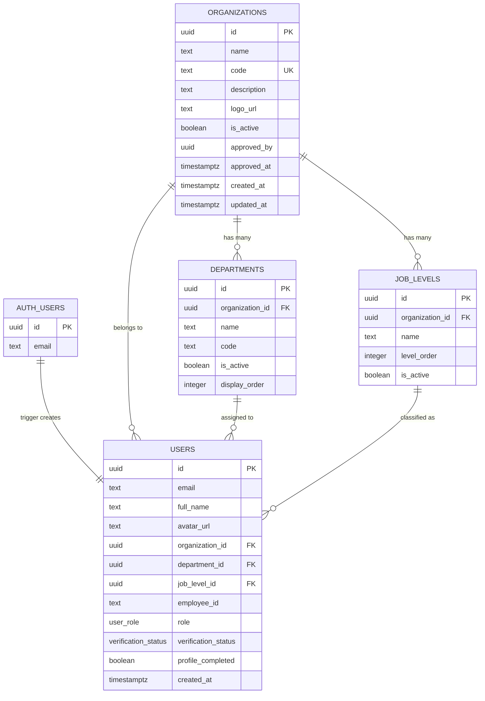
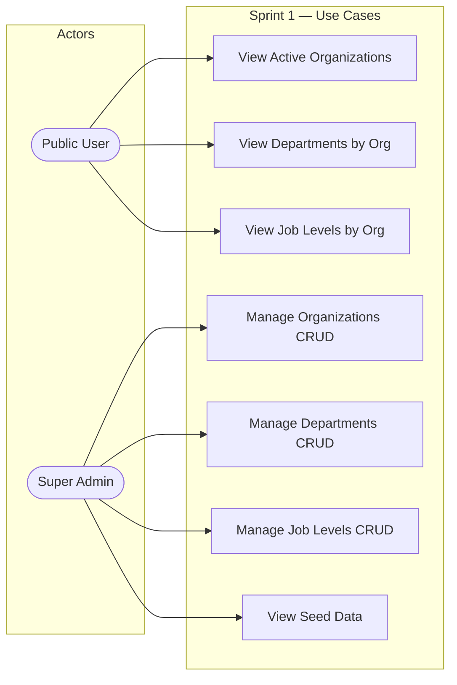
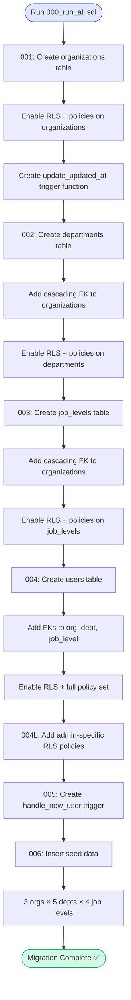
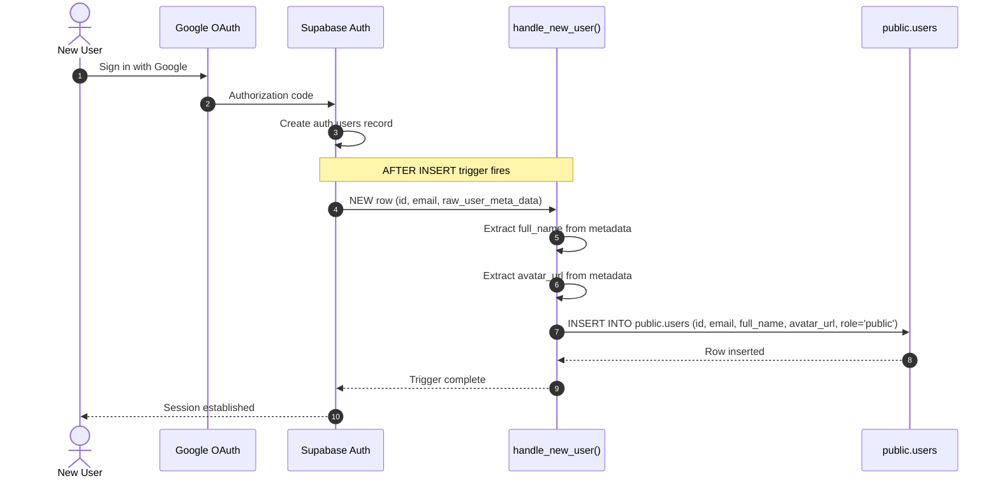

# Sprint 1 Review — Project Foundation & Database Design

**Project**: LokAI — AI-Powered Exam Preparation Platform for Nepal Government Employees  
**Sprint**: 1 of 13 planned sprints  
**Tech Stack**: Next.js 16 (App Router) · React 19 · Supabase (PostgreSQL + Auth) · Tailwind CSS 4 · shadcn/ui · TanStack Query · Framer Motion · TypeScript

---

## Sprint Goal

Set up the project skeleton, database schema with Row-Level Security, and development environment.

---

## Deliverables Completed (13/13 — 100%)

| # | Task | Status |
|---|------|--------|
| 1.1 | Initialize Next.js 16 project with TypeScript, Tailwind CSS 4, ESLint | ✅ |
| 1.2 | Install core dependencies (Supabase SSR, TanStack Query, Framer Motion, Radix UI, Zod, React Hook Form, Recharts, Sonner, Lucide icons) | ✅ |
| 1.3 | Configure Supabase browser client (`client.ts`) and server client (`server.ts`) | ✅ |
| 1.4 | Create combined migration script (`migrations/000_run_all.sql`) | ✅ |
| 1.5 | Design `organizations` table with RLS policies | ✅ |
| 1.6 | Design `departments` table with cascading FK, composite unique constraint | ✅ |
| 1.7 | Design `job_levels` table with org FK, level ordering | ✅ |
| 1.8 | Design `users` table with role/verification enums, full RLS policy set | ✅ |
| 1.9 | Create shared `update_updated_at()` trigger function | ✅ |
| 1.10 | Create `handle_new_user()` trigger for auto-populating users on auth signup | ✅ |
| 1.11 | Seed 3 organizations (MOFA, NEA, NRB) with departments and job levels | ✅ |
| 1.12 | Define TypeScript types matching DB schema (`types/database.ts`) | ✅ |
| 1.13 | Create utility function `cn()` for Tailwind class merging | ✅ |

---

## Key Files Produced

| File | Purpose |
|------|---------|
| `migrations/000_run_all.sql` | Full database schema (7 sections), RLS policies, triggers, seed data |
| `lib/supabase/client.ts` | Browser-side Supabase client (cookie-based auth) |
| `lib/supabase/server.ts` | Server-side Supabase client (async cookie access) |
| `types/database.ts` | TypeScript interfaces: Organization, Department, JobLevel, User, UserWithDetails |
| `lib/utils.ts` | Tailwind `cn()` merge utility |

---

## Diagrams

### 1. ER Diagram — Database Schema

> See: [er-diagram.md](./er-diagram.md)

### 2. Use Case Diagram — Sprint 1

> See: [use-case-diagram.md](./use-case-diagram.md)

### 3. Activity Diagram — Database Migration Execution

> See: [activity-diagram-migration.md](./activity-diagram-migration.md)

### 4. Sequence Diagram — Auto User Creation Trigger

> See: [sequence-diagram-trigger.md](./sequence-diagram-trigger.md)

---

## Database Design Decisions

| Decision | Rationale |
|----------|-----------|
| UUID primary keys | Supabase standard, prevents enumeration attacks |
| Composite unique `(org_id, code)` on departments | Allows same dept code across different orgs |
| `level_order` on job_levels | Enables ascending seniority sorting |
| Role enum (`public/employee/org_admin/super_admin`) | Fixed role hierarchy, no dynamic RBAC overhead |
| Verification status enum (`none/pending/verified/rejected`) | Clear state machine for employee onboarding |
| RLS on all 4 tables | Defense-in-depth — database enforces access even if API has bugs |
| `handle_new_user()` trigger | Auto-creates public.users row from auth.users signup — zero manual sync |
| Idempotent migration (`IF NOT EXISTS`) | Safe to re-run without errors |

---

## Seed Data

| Organization | Code | Departments | Job Levels |
|-------------|------|-------------|------------|
| Ministry of Federal Affairs and General Administration | MOFA | 5 | 4 |
| Nepal Electricity Authority | NEA | 5 | 4 |
| Nepal Rastra Bank | NRB | 5 | 4 |

---

## Sprint 1 Retrospective

| Category | Notes |
|----------|-------|
| **What went well** | Clean separation of DB concerns with 7-section migration. TypeScript types perfectly mirror DB schema. RLS policies cover all role combinations. |
| **What could improve** | No automated migration runner yet — SQL must be pasted into Supabase SQL Editor manually. |
| **Risks mitigated** | Type safety between frontend and DB ensured via `database.ts`. Auth trigger eliminates manual user creation bugs. |
| **Carry-forward** | Supabase client configs are reused in every subsequent sprint. Seed data enables immediate testing. |
