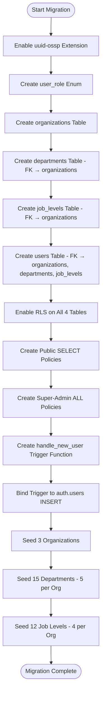

# Sprint 1 — Activity Diagram: Migration Execution

> **Type**: Activity Diagram  
> **Sprint**: 1 — Project Foundation & Database Design  
> **Purpose**: Illustrates the sequential execution flow of the `000_run_all.sql` migration, showing how database objects are created in dependency order.

## Diagram

## Migration Sections

| # | Section | SQL Objects Created | Dependencies |
|---|---------|-------------------|--------------|
| 1 | Extensions | `uuid-ossp` | None |
| 2 | Enums | `user_role` (employee, admin, super_admin) | None |
| 3 | Organizations Table | `organizations` + `updated_at` trigger | uuid-ossp |
| 4 | Departments Table | `departments` + `updated_at` trigger | organizations (FK) |
| 5 | Job Levels Table | `job_levels` + `updated_at` trigger | organizations (FK) |
| 6 | Users Table | `users` + `updated_at` trigger | organizations, departments, job_levels (FKs) |
| 7 | RLS Policies | 8 policies (2 per table: public + admin) | All 4 tables |
| 8 | Trigger Function | `handle_new_user()` | users table |
| 9 | Trigger Binding | `on_auth_user_created` | auth.users, handle_new_user() |
| 10 | Seed: Organizations | 3 rows (Nepal Rastra Bank, Nepal Police, Ministry of Education) | organizations table |
| 11 | Seed: Departments | 15 rows (5 per org) | departments table, organizations data |
| 12 | Seed: Job Levels | 12 rows (4 per org) | job_levels table, organizations data |

## Key Design Decisions

- **Dependency order**: Tables are created in FK dependency order — `organizations` first, then tables that reference it.
- **RLS before data**: Row-Level Security is enabled before seed data is inserted, ensuring policies are active immediately.
- **Trigger before seeding**: The `handle_new_user()` trigger is created before seeding so that any auth signup during development automatically creates a user row.
- **Single migration file**: All SQL is consolidated into `000_run_all.sql` for atomic execution.
