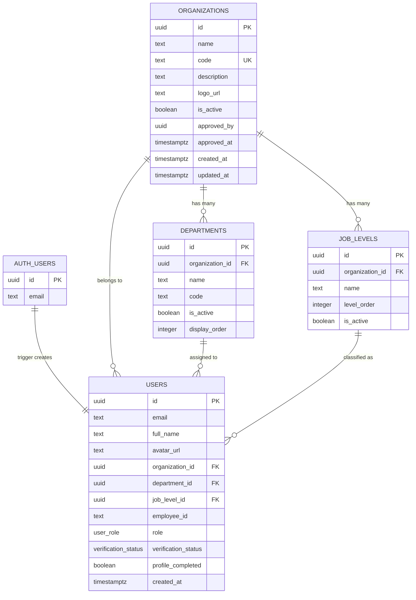

# Sprint 1 — ER Diagram (Database Schema)

> **Type**: Entity-Relationship Diagram  
> **Sprint**: 1 — Project Foundation & Database Design  
> **Purpose**: Shows the complete database schema designed in Sprint 1, with all tables, columns, types, and relationships.

## Diagram

## Relationships

| Parent | Child | Cardinality | Constraint |
|--------|-------|-------------|------------|
| `auth.users` | `public.users` | 1:1 | `handle_new_user()` trigger auto-creates |
| `organizations` | `departments` | 1:many | FK with CASCADE delete |
| `organizations` | `job_levels` | 1:many | FK with CASCADE delete |
| `organizations` | `users` | 1:many | FK (nullable — user may not have org yet) |
| `departments` | `users` | 1:many | FK (nullable) |
| `job_levels` | `users` | 1:many | FK (nullable) |

## Enums

| Enum | Values | Used In |
|------|--------|---------|
| `user_role` | `public`, `employee`, `org_admin`, `super_admin` | `users.role` |
| `verification_status` | `none`, `pending`, `verified`, `rejected` | `users.verification_status` |

## RLS Policies

| Table | Policy | Rule |
|-------|--------|------|
| `organizations` | Anyone can view active | `SELECT WHERE is_active = true` |
| `organizations` | Super admin full access | `ALL` for `super_admin` role |
| `departments` | Anyone can view active | `SELECT WHERE is_active = true` |
| `job_levels` | Anyone can view active | `SELECT WHERE is_active = true` |
| `users` | Users read own data | `SELECT WHERE id = auth.uid()` |
| `users` | Users update own data | `UPDATE WHERE id = auth.uid()` |
| `users` | Org admin reads org users | `SELECT WHERE organization_id matches` |
| `users` | Super admin reads all | `SELECT` for `super_admin` role |
