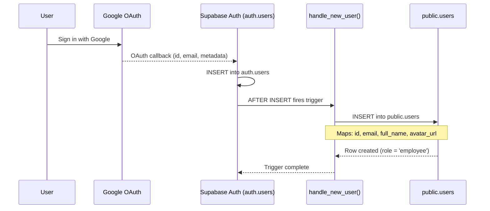

# Sprint 1 — Sequence Diagram: handle_new_user() Trigger

> **Type**: Sequence Diagram  
> **Sprint**: 1 — Project Foundation & Database Design  
> **Purpose**: Shows the automatic user-row creation flow when a new user signs up through Google OAuth, triggered by the `handle_new_user()` PostgreSQL function.

## Diagram

## Trigger Flow Details

| Step | Source | Target | Data Transferred |
|------|--------|--------|-----------------|
| 1 | User | Google | Google account credentials |
| 2 | Google | auth.users | `id`, `email`, `raw_user_meta_data` (full_name, avatar_url) |
| 3 | auth.users | handle_new_user() | `NEW` row record (trigger argument) |
| 4 | handle_new_user() | public.users | `id`, `email`, `full_name`, `avatar_url` |

## Field Mapping

| auth.users Field | public.users Field | Extraction |
|------------------|--------------------|------------|
| `NEW.id` | `id` | Direct copy (UUID) |
| `NEW.email` | `email` | Direct copy |
| `NEW.raw_user_meta_data->>'full_name'` | `full_name` | JSON extraction |
| `NEW.raw_user_meta_data->>'avatar_url'` | `avatar_url` | JSON extraction |
| *(default)* | `role` | Hardcoded: `'employee'` |
| *(default)* | `is_verified` | Hardcoded: `false` |
| *(default)* | `is_profile_complete` | Hardcoded: `false` |

## Key Points

- **Automatic execution**: The trigger fires automatically on every `auth.users` INSERT — no application code needed.
- **Default role**: All new users start as `employee` with `is_verified = false`.
- **Profile incomplete**: `is_profile_complete` defaults to `false`, requiring the user to complete profile setup later (Sprint 2).
- **Idempotent metadata**: If Google metadata is missing, fields default to `NULL`.
