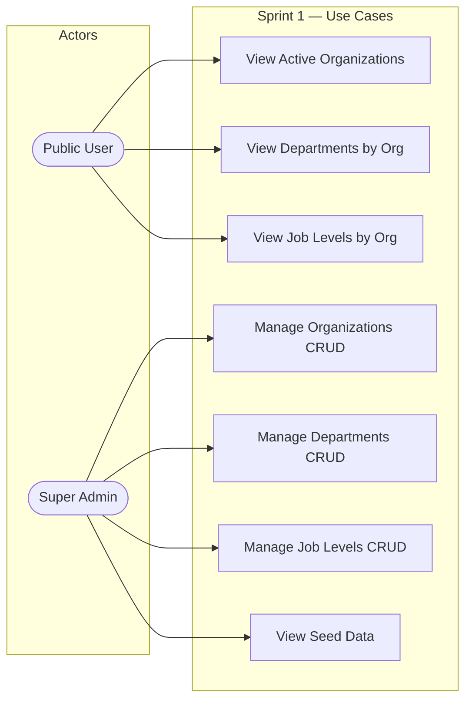

# Sprint 1 — Use Case Diagram

> **Type**: Use Case Diagram  
> **Sprint**: 1 — Project Foundation & Database Design  
> **Purpose**: Shows the actors and their interactions with the system as defined by the Sprint 1 database schema, seed data, and RLS policies.

## Diagram

## Actor Descriptions

| Actor | Description | Sprint 1 Capabilities |
|-------|-------------|----------------------|
| **Public User** | Any unauthenticated visitor | Can view active organizations, departments, and job levels (via RLS `SELECT WHERE is_active = true`) |
| **Super Admin** | Platform-wide administrator | Full CRUD on organizations, departments, and job levels (via RLS `ALL` policy) |

## Use Case Details

| # | Use Case | Actor | Pre-condition | Post-condition |
|---|----------|-------|---------------|----------------|
| UC1 | View Active Organizations | Public User | None | Returns list of orgs where `is_active = true` |
| UC2 | View Departments by Org | Public User | Valid `organization_id` | Returns departments for the given org |
| UC3 | View Job Levels by Org | Public User | Valid `organization_id` | Returns job levels ordered by `level_order` |
| UC4 | Manage Organizations | Super Admin | Authenticated as super_admin | Can create, read, update, delete any org |
| UC5 | Manage Departments | Super Admin | Authenticated as super_admin | Can CRUD departments in any org |
| UC6 | Manage Job Levels | Super Admin | Authenticated as super_admin | Can CRUD job levels in any org |
| UC7 | View Seed Data | Super Admin | Seed migration executed | Can verify 3 orgs × 5 depts × 4 levels exist |
