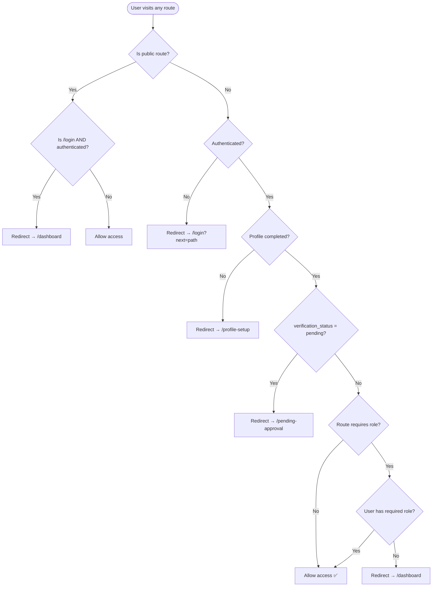

# Sprint 2 — Activity Diagram: Route Protection Middleware

> **Type**: Activity Diagram  
> **Sprint**: 2 — Authentication & User Onboarding  
> **Purpose**: Illustrates the 5-step middleware pipeline in `proxy.ts` that protects routes based on authentication, profile completion, verification status, and role.

## Diagram

## Pipeline Steps

| Step | Check | Fail Action | Pass Action |
|------|-------|-------------|-------------|
| 1 | Is the route public? (`/`, `/login`) | Continue to Step 2 | Allow access (unless `/login` + authenticated → redirect to `/dashboard`) |
| 2 | Is user authenticated? (Supabase session) | Redirect to `/login?next=<path>` | Continue to Step 3 |
| 3 | Is profile completed? (`profile_completed = true`) | Redirect to `/profile-setup` | Continue to Step 4 |
| 4 | Is verification status pending? (`verification_status = 'pending'`) | Redirect to `/pending-approval` | Continue to Step 5 |
| 5 | Does user have the required role? | Redirect to `/dashboard` | Allow access ✅ |

## Public Routes

| Route | Accessible To |
|-------|---------------|
| `/` | Everyone |
| `/login` | Unauthenticated users (authenticated users redirected to `/dashboard`) |
| `/auth/callback` | Supabase OAuth callback handler |
| `/api/*` | API routes (protected by their own auth checks) |

## Security Considerations

- **Session refresh**: Middleware calls `supabase.auth.getUser()` on every request to refresh tokens automatically.
- **Redirect loop prevention**: Public route check runs first to prevent infinite `/login` → `/login` loops.
- **`next` parameter**: Original URL stored in query param so user returns to intended page after login.
- **Role hierarchy**: `/admin/*` requires `org_admin` or `super_admin`; `/super-admin/*` requires `super_admin`.
