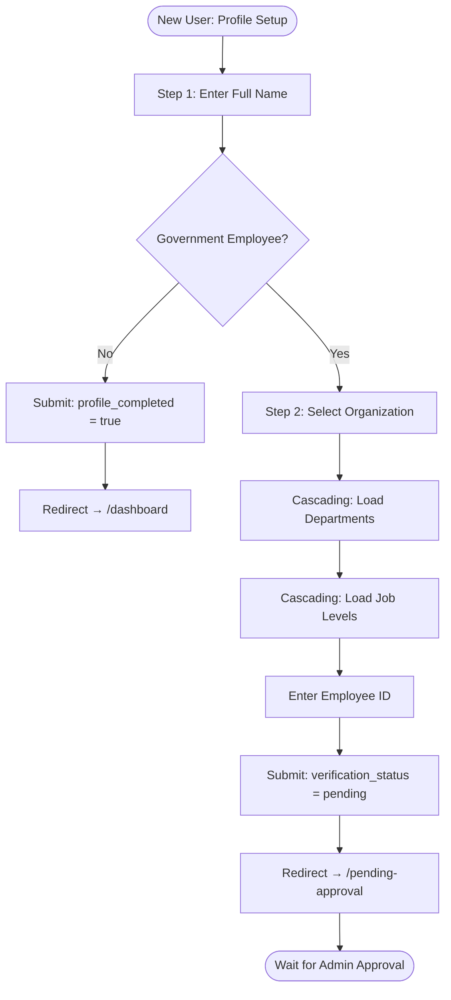

# Sprint 2 — Activity Diagram: Profile Setup Flow

> **Type**: Activity Diagram  
> **Sprint**: 2 — Authentication & User Onboarding  
> **Purpose**: Shows the 2-step profile setup wizard flow, including the government employee branching path with cascading selectors and verification request.

## Diagram



## Step Details

| Step | Component | User Action | API Call |
|------|-----------|-------------|----------|
| Step 1 | Full Name input | Enter or confirm name (pre-filled from Google) | None |
| Toggle | "Government Employee" switch | Toggle Yes/No | None |
| Step 2a | OrganizationSelector | Select from dropdown | `GET /api/organizations` |
| Step 2b | DepartmentSelector | Select from filtered list | `GET /api/departments?organization_id=xxx` |
| Step 2c | JobLevelSelector | Select from filtered list | `GET /api/job-levels?organization_id=xxx` |
| Step 2d | Employee ID input | Enter government employee ID | None |
| Submit | Form submission | Click "Complete Profile" | `PUT /api/users/profile` |

## Cascading Selector Behavior

```
Organization (selected)
    └── Departments API called with org_id
        └── Department (selected)
            └── Job Levels API called with org_id
                └── Job Level (selected)
```

- When organization changes, departments and job levels reset
- Each selector shows a loading spinner while fetching
- TanStack Query caches results (60s stale time) to avoid repeated fetches

## Branching Paths

| Path | Condition | Profile Fields Set | Redirect |
|------|-----------|-------------------|----------|
| **Non-Employee** | Toggle = No | `full_name`, `profile_completed = true` | `/dashboard` |
| **Employee** | Toggle = Yes | `full_name`, `organization_id`, `department_id`, `job_level_id`, `employee_id`, `verification_status = 'pending'`, `profile_completed = true` | `/pending-approval` |

## Validation (Zod Schema)

- `full_name`: Required, min 2 characters
- `organization_id`: Required if government employee
- `department_id`: Required if government employee
- `job_level_id`: Required if government employee
- `employee_id`: Required if government employee
