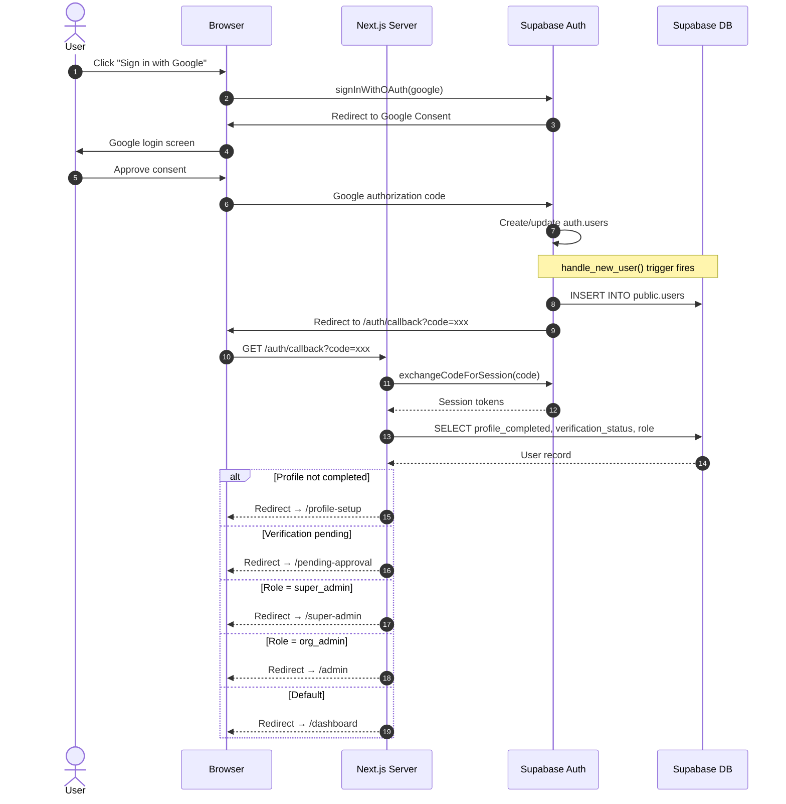

# Sprint 2 — Sequence Diagram: Google OAuth Authentication Flow

> **Type**: Sequence Diagram  
> **Sprint**: 2 — Authentication & User Onboarding  
> **Purpose**: Shows the complete Google OAuth sign-in flow from user click through session creation and role-based routing.

## Diagram

## Flow Steps

| Step | From | To | Action |
|------|------|----|--------|
| 1 | User | Browser | Clicks Google sign-in button on `/login` page |
| 2 | Browser | Supabase Auth | Initiates OAuth with `signInWithOAuth({ provider: 'google' })` |
| 3 | Supabase | Browser | Returns Google consent screen URL |
| 4-5 | User | Google | Approves OAuth permissions |
| 6 | Google | Supabase | Sends authorization code |
| 7 | Supabase | auth.users | Creates or updates user record |
| 8 | Trigger | public.users | `handle_new_user()` inserts row (Sprint 1 trigger) |
| 9 | Supabase | Browser | Redirects to `/auth/callback?code=xxx` |
| 10-11 | Next.js | Supabase | Exchanges code for session tokens server-side |
| 12-13 | Next.js | DB | Fetches user profile for routing decision |
| 14 | Next.js | Browser | Redirects based on profile/role state |

## Routing Decision Logic

| Condition | Redirect Target |
|-----------|----------------|
| `profile_completed = false` | `/profile-setup` |
| `verification_status = 'pending'` | `/pending-approval` |
| `role = 'super_admin'` | `/super-admin` |
| `role = 'org_admin'` | `/admin` |
| Default (employee) | `/dashboard` |
