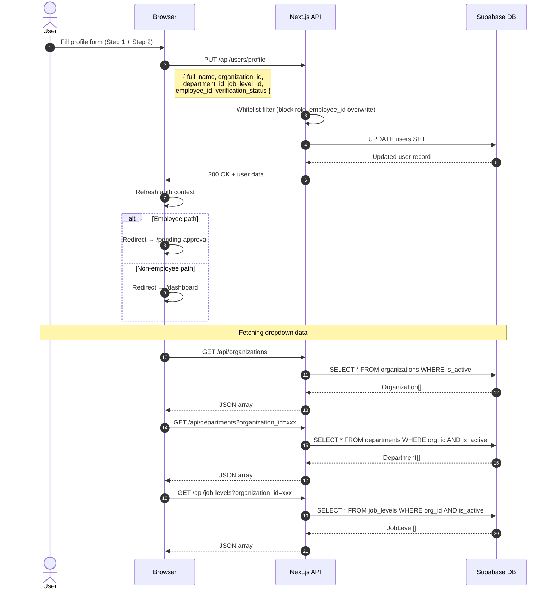

# Sprint 2 — Sequence Diagram: Profile Setup API Calls

> **Type**: Sequence Diagram  
> **Sprint**: 2 — Authentication & User Onboarding  
> **Purpose**: Shows the API call sequence during profile setup, including form submission with field whitelist and cascading dropdown data fetching.

## Diagram

## API Call Details

| # | Method | Endpoint | Trigger | Response |
|---|--------|----------|---------|----------|
| 1 | PUT | `/api/users/profile` | Form submission | Updated user record |
| 2 | GET | `/api/organizations` | Page load | Array of active organizations |
| 3 | GET | `/api/departments?organization_id=xxx` | Organization selected | Filtered departments |
| 4 | GET | `/api/job-levels?organization_id=xxx` | Organization selected | Filtered job levels |

## Field Whitelist Security

| Field | Allowed in PUT | Reason |
|-------|---------------|--------|
| `full_name` | ✅ | User-editable |
| `organization_id` | ✅ | Selected in profile setup |
| `department_id` | ✅ | Selected in profile setup |
| `job_level_id` | ✅ | Selected in profile setup |
| `profile_completed` | ✅ | Set to `true` on submission |
| `role` | ❌ BLOCKED | Prevents privilege escalation |
| `employee_id` | ❌ BLOCKED | Admin-assigned only |
| `verification_status` | ❌ BLOCKED (direct overwrite) | Controlled by application logic |

## TanStack Query Caching

- **Stale time**: 60 seconds — dropdown data cached to avoid refetching on step navigation
- **Retry**: 1 attempt on failure
- **Query keys**: `['organizations']`, `['departments', orgId]`, `['jobLevels', orgId]`
