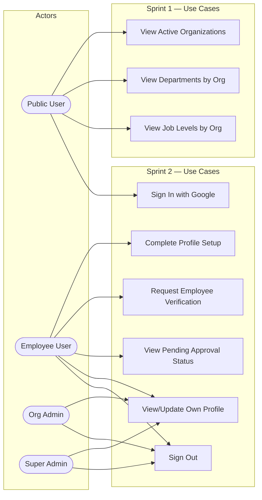

# Sprint 2 — Use Case Diagram: Sprint 1 & 2

> **Type**: Use Case Diagram  
> **Sprint**: 2 — Authentication & User Onboarding  
> **Purpose**: Shows all actors and their interactions with the system after Sprint 1 (database foundation) and Sprint 2 (auth & onboarding).

## Diagram

## Actor Descriptions

| Actor | Description | Sprint 2 Capabilities |
|-------|-------------|----------------------|
| **Public User** | Unauthenticated visitor | View reference data, sign in via Google OAuth |
| **Employee User** | Authenticated user with `role = employee` | Complete profile, request verification, view approval status |
| **Org Admin** | Organization-level administrator | View/update own profile, sign out |
| **Super Admin** | Platform-wide administrator | View/update own profile, sign out |

## Use Case Details

| # | Use Case | Actor(s) | Pre-condition | Post-condition |
|---|----------|----------|---------------|----------------|
| UC1 | View Active Organizations | Public User | None | Returns active orgs list |
| UC2 | View Departments by Org | Public User | Valid org_id | Returns filtered departments |
| UC3 | View Job Levels by Org | Public User | Valid org_id | Returns job levels ordered by level_order |
| UC4 | Sign In with Google | Public User | Has Google account | Session created, redirected by role |
| UC5 | Complete Profile Setup | Employee User | Authenticated, profile incomplete | Profile marked complete |
| UC6 | Request Employee Verification | Employee User | Profile completed as gov employee | verification_status = 'pending' |
| UC7 | View Pending Approval Status | Employee User | verification_status = 'pending' | Sees current status + rejection reason if applicable |
| UC8 | View/Update Own Profile | All authenticated | Authenticated | Profile data retrieved/updated |
| UC9 | Sign Out | All authenticated | Has active session | Session destroyed, redirected to `/` |
