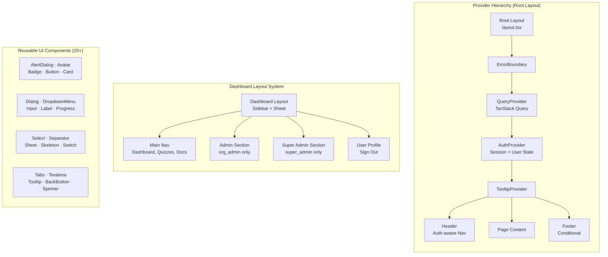

# Sprint 3 — UI Component Architecture Diagram

> **Type**: Architecture Diagram  
> **Sprint**: 3 — UI Component Library & Layout System  
> **Purpose**: Shows the provider hierarchy, dashboard layout system, and the reusable UI component library built in Sprint 3.

## Diagram

## Provider Hierarchy Details

| Level | Component | Purpose |
|-------|-----------|---------|
| 1 | Root Layout | HTML/body wrapper, font loading, metadata |
| 2 | ErrorBoundary | Catches unhandled errors, shows fallback UI |
| 3 | QueryProvider | TanStack Query client (60s stale, 1 retry, devtools in dev) |
| 4 | AuthProvider | Supabase session management, user state, signIn/signOut |
| 5 | TooltipProvider | Enables tooltips across all child components |
| 6 | Header / Page / Footer | Actual page content with auth-aware navigation |

## Dashboard Layout Reuse

| Layout File | Role Constraint | Reuses Dashboard Layout |
|-------------|----------------|------------------------|
| `app/dashboard/layout.tsx` | All authenticated | Base sidebar layout |
| `app/admin/layout.tsx` | `org_admin`, `super_admin` | ✅ Same component |
| `app/super-admin/layout.tsx` | `super_admin` | ✅ Same component |

## Loading Component Catalog

| Component | Usage | Skeleton Type |
|-----------|-------|---------------|
| `PageSkeleton` | Full page loading | Header + content area |
| `CardSkeleton` | Card grid loading | Card-shaped pulses |
| `TableSkeleton` | Table data loading | Row-shaped pulses |
| `FormSkeleton` | Form loading | Input-shaped pulses |
| `Spinner` | Inline loading indicator | Circular animation |
| `FullPageSpinner` | Route transitions | Centered full-page spinner |
