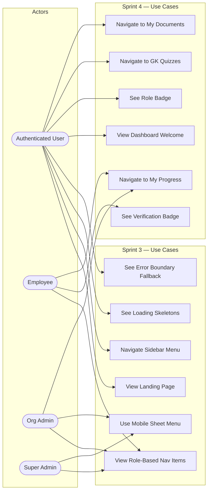

# Sprint 3 & 4 — Use Case Diagram

> **Type**: Use Case Diagram  
> **Sprint**: 3 & 4 — UI Component Library, Layout System, Dashboard & Landing Page  
> **Purpose**: Shows all actors and their interactions with the UI component system (Sprint 3) and the dashboard/landing page features (Sprint 4).

## Diagram

## Actor Descriptions

| Actor | Sprint 3 Capabilities | Sprint 4 Capabilities |
|-------|----------------------|----------------------|
| **Authenticated User** | View landing page, navigate sidebar, see loading skeletons, trigger error boundary | View dashboard welcome, see role badge, navigate to features |
| **Employee** | View role-based nav items, see verification badge | Navigate to My Progress |
| **Org Admin** | View admin nav section, use mobile sheet | Navigate to My Progress |
| **Super Admin** | View super-admin nav section, use mobile sheet | — |

## Sprint 3 Use Cases

| # | Use Case | Description |
|---|----------|-------------|
| UC1 | View Landing Page | See hero section, interactive quiz demo, feature highlights |
| UC2 | Navigate Sidebar Menu | Access dashboard pages via sidebar navigation |
| UC3 | View Role-Based Nav Items | See admin/super-admin sections based on role |
| UC4 | Use Mobile Sheet Menu | Open sidebar as slide-over sheet on mobile |
| UC5 | See Loading Skeletons | View skeleton UI during data fetching |
| UC6 | See Error Boundary Fallback | See fallback UI when an error occurs |

## Sprint 4 Use Cases

| # | Use Case | Description |
|---|----------|-------------|
| UC7 | View Dashboard Welcome | See personalized welcome message with user name |
| UC8 | See Role Badge | View current role as a badge (employee/org_admin/super_admin) |
| UC9 | See Verification Badge | View verification status (✅ verified / ⏳ pending) |
| UC10 | Navigate to GK Quizzes | Click feature card to go to `/dashboard/quizzes` |
| UC11 | Navigate to My Documents | Click feature card to go to `/dashboard/documents` |
| UC12 | Navigate to My Progress | Click feature card to go to `/dashboard/progress` |
