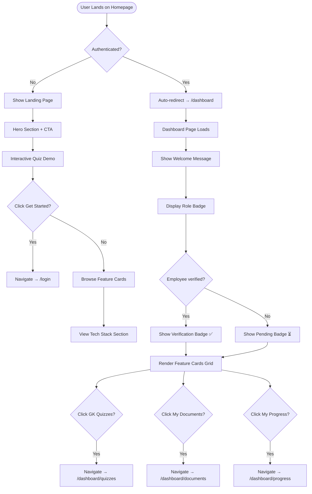

# Sprint 4 — Activity Diagram: Landing Page & Dashboard Navigation

> **Type**: Activity Diagram  
> **Sprint**: 4 — Dashboard & Landing Page  
> **Purpose**: Shows the user flow from landing page through authentication to dashboard, including feature card navigation paths.

## Diagram

## Navigation Flow Details

### Landing Page Flow (Unauthenticated)

| Step | Element | User Action | Result |
|------|---------|-------------|--------|
| 1 | Hero Section | View animated entrance | See platform intro + CTA |
| 2 | Quiz Demo | Answer 5 Nepal GK questions | See score + answer validation |
| 3 | Feature Cards | Browse capabilities | View AI quiz, document, progress features |
| 4 | Tech Stack | Scroll down | See technology logos and descriptions |
| 5 | CTA Button | Click "Get Started" | Navigate to `/login` |

### Dashboard Flow (Authenticated)

| Step | Element | User Action | Result |
|------|---------|-------------|--------|
| 1 | Welcome | Auto-redirect from `/` | See personalized greeting |
| 2 | Role Badge | View | See current role (employee/org_admin/super_admin) |
| 3 | Verification Badge | View | See ✅ verified or ⏳ pending |
| 4 | GK Quizzes Card | Click | Navigate to `/dashboard/quizzes` |
| 5 | My Documents Card | Click | Navigate to `/dashboard/documents` |
| 6 | My Progress Card | Click (employee/org_admin only) | Navigate to `/dashboard/progress` |

## Auto-Redirect Logic

| Condition | Behavior |
|-----------|----------|
| Authenticated user visits `/` | Redirected to `/dashboard` by middleware |
| Unauthenticated user visits `/dashboard` | Redirected to `/login?next=/dashboard` by middleware |
| Any user visits non-existent route | Shows animated 404 page |
