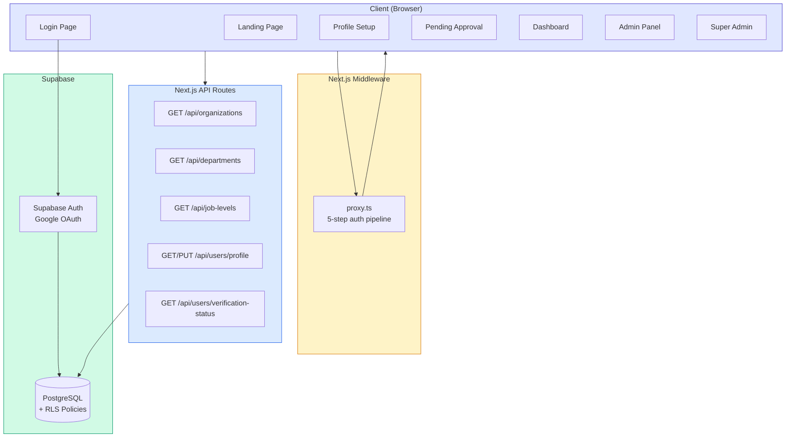

# Sprint 4 — Overall Architecture Diagram (After Sprint 1–4)

> **Type**: Architecture Diagram  
> **Sprint**: 4 — Dashboard & Landing Page  
> **Purpose**: Shows the complete system architecture after all 4 completed sprints, including client pages, middleware, API routes, and Supabase backend.

## Diagram

## Architecture Layers

| Layer | Technology | Components |
|-------|-----------|------------|
| **Client** | Next.js 16 + React 19 | 7 client pages: Landing, Login, Profile Setup, Pending Approval, Dashboard, Admin, Super Admin |
| **Middleware** | `proxy.ts` | 5-step auth pipeline: public route check → auth check → profile check → verification check → role check |
| **API** | Next.js Route Handlers | 5 endpoints: organizations, departments, job-levels, user profile, verification status |
| **Auth** | Supabase Auth | Google OAuth provider, session management, token refresh |
| **Database** | PostgreSQL + RLS | 4 tables (organizations, departments, job_levels, users), 8 RLS policies, 1 trigger |

## Data Flow

| Flow | Path |
|------|------|
| Page request | Browser → Middleware (proxy.ts) → Page Component |
| API request | Browser → API Route → Supabase DB (via RLS) |
| Authentication | Browser → Supabase Auth → Google OAuth → auth.users → trigger → public.users |
| Session refresh | Middleware → Supabase Auth → Refresh tokens on every request |

## Sprint Contribution Map

| Sprint | Layer | What Was Added |
|--------|-------|---------------|
| **Sprint 1** | Database | 4 tables, RLS policies, trigger, seed data |
| **Sprint 2** | Auth + API + Middleware | OAuth flow, 5 API routes, route protection, profile setup, selectors |
| **Sprint 3** | Client | 20+ UI components, layout system, provider hierarchy, loading states |
| **Sprint 4** | Client | Landing page, dashboard, admin/super-admin stubs |
