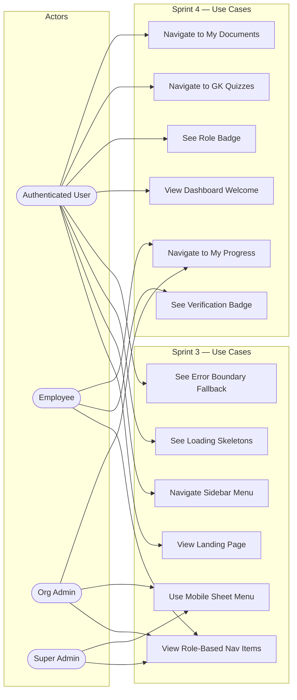

# Sprint 4 — Use Case Diagram: Sprint 3 & 4

> **Type**: Use Case Diagram  
> **Sprint**: 4 — Dashboard & Landing Page  
> **Purpose**: Shows all actors and their interactions with the UI/layout system (Sprint 3) and dashboard/landing page features (Sprint 4).

## Diagram

## Use Case Details

| # | Use Case | Actor(s) | Sprint | Description |
|---|----------|----------|--------|-------------|
| UC1 | View Landing Page | All | 3 | Hero, quiz demo, feature highlights |
| UC2 | Navigate Sidebar Menu | All authenticated | 3 | Dashboard sidebar navigation |
| UC3 | View Role-Based Nav Items | EMP, OA, SA | 3 | Admin/super-admin sections visible by role |
| UC4 | Use Mobile Sheet Menu | OA, SA | 3 | Slide-over sheet on mobile devices |
| UC5 | See Loading Skeletons | All authenticated | 3 | Skeleton UI during data fetching |
| UC6 | See Error Boundary Fallback | All authenticated | 3 | Fallback UI on unhandled errors |
| UC7 | View Dashboard Welcome | All authenticated | 4 | Personalized welcome with user name |
| UC8 | See Role Badge | All authenticated | 4 | Badge showing current role |
| UC9 | See Verification Badge | EMP | 4 | ✅ verified or ⏳ pending badge |
| UC10 | Navigate to GK Quizzes | All authenticated | 4 | Feature card → `/dashboard/quizzes` |
| UC11 | Navigate to My Documents | All authenticated | 4 | Feature card → `/dashboard/documents` |
| UC12 | Navigate to My Progress | EMP, OA | 4 | Feature card → `/dashboard/progress` |
